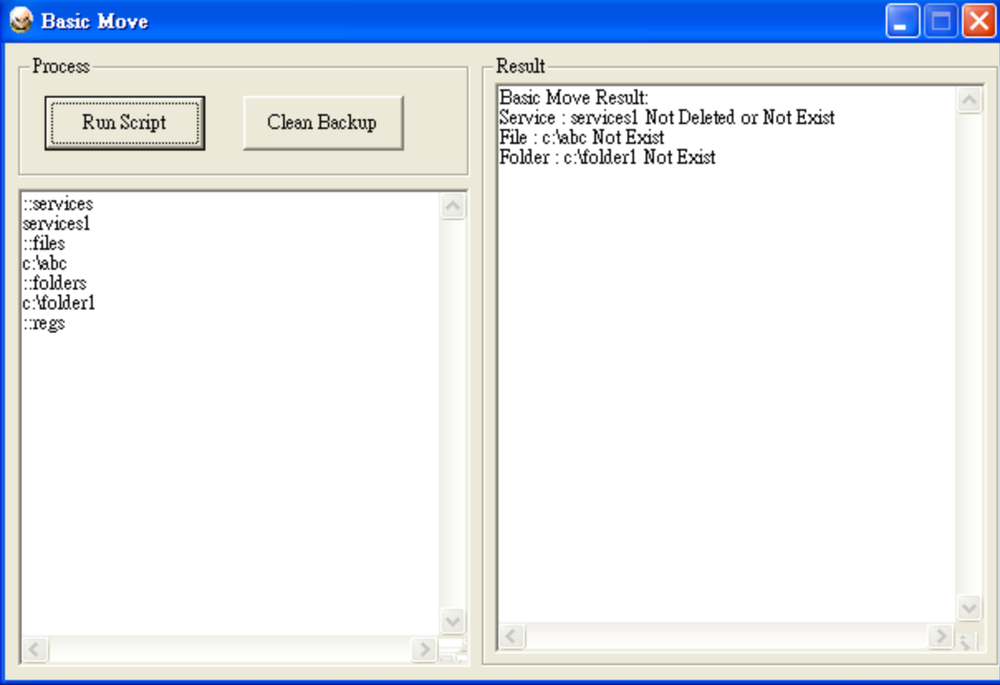

BasicMove
=========

BasicMove is a simple scripting program, aimed at remove programs. Created in 2009. A "BasicMove" folder will be created at system drive after the script execution.

Sessions
---------

  - ::services
  - ::files
  - ::folders
  - ::regs

Sample script
--------------

```
::services
serviceName1
::files
c:\autorun.inf
::folders
c:\abc
c:\def
::regs
[-HKEY_LOCAL_MACHINE\Software\Test]
[HKEY_LOCAL_MACHINE\Software\Test]
"TestValue"=-
```

Screenshots
-----------



License
----

MIT
    
